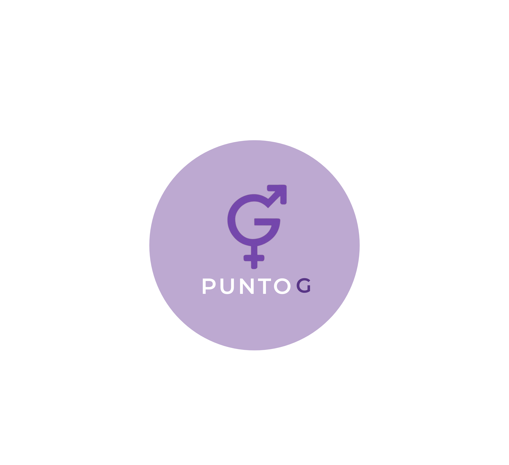

<p align="center">
  
</p>

<h1 align="center">Punto G 🌸</h1>
<p align="center"><em>A modern platform for sexual education events and workshops.</em></p>

## About

**Punto G** is an initiative to promote sexual education through engaging events, workshops, and community discussions. Our goal is to create a safe space for learning and dialogue around sexual health, consent, and empowerment.

## Features

- 📅 Event listings & registration
- 🎤 Expert-led workshops
- 🔒 Safe & inclusive environment
- 📚 Educational resources
- 💬 Community discussions

## Tech Stack  
**Built with Flutter for a seamless cross-platform experience:**  
- **Frontend**:  Flutter (Dart)  

## Getting Started

1. Clone the repository:
   
   ```bash
   git clone https://github.com/yourusername/f_project1_movil.git
   
2. Done
